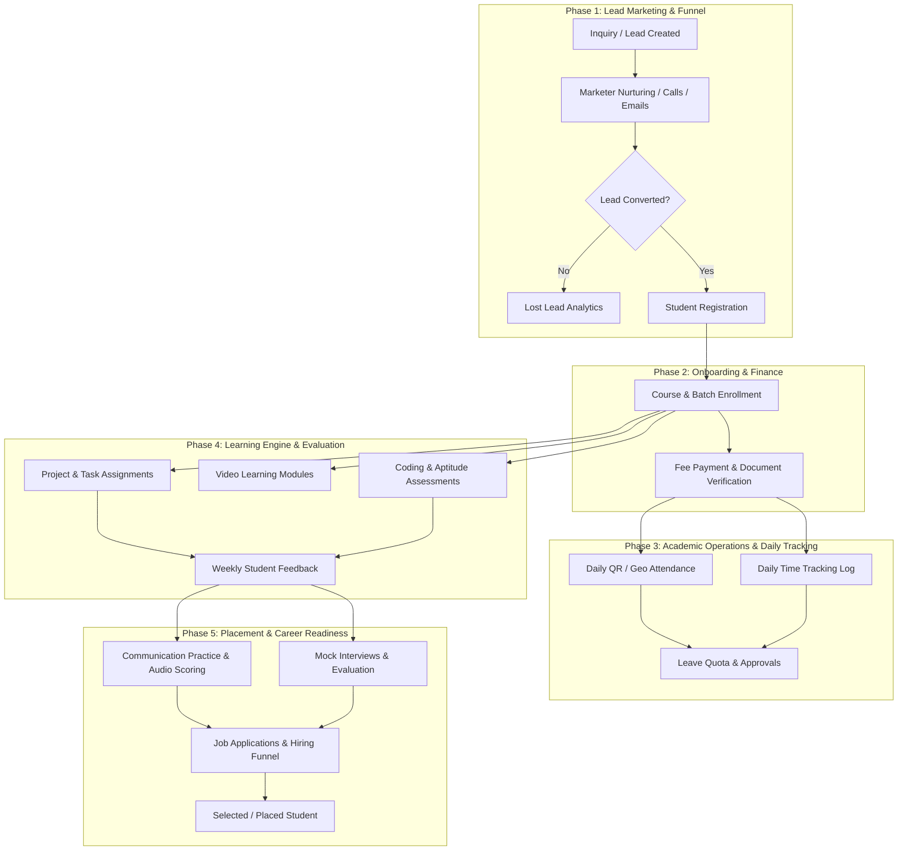

# 📊 Complete LMS Architecture, Business Flow & Database Table Structure
> **Target Audience:** Data Analytics & Data Engineering Students  
> **System Scope:** Enterprise Learning Management System (LMS) with Lead Marketing, Finance, Attendance Tracking, Academics, Evaluation Engine & Job Placement Modules.

---

## 🎯 1. High-Level System Overview & Business Flow

This Learning Management System (LMS) automates the complete **Student Lifecycle** from initial inquiry (lead) to final job placement. For a Data Analyst, understanding this end-to-end lifecycle is key to building funnel reports, churn prediction models, financial dashboards, and student performance metrics.



---

## 👥 2. User Roles & Permission Matrix

The system enforces 5 distinct roles defined in `Role` enum:

| Role | Business Responsibilities | Primary Tables Interacted With |
| :--- | :--- | :--- |
| **`SUPER_ADMIN` / `ADMIN`** | Full system control, batch creation, course fee setup, leave approvals, user permissions | `users`, `admin_permissions`, `courses`, `batches`, `registrations`, `leave_requests` |
| **`TRAINER`** | Managing assigned batches, creating projects/tasks, marking/viewing attendance, grading assessments | `batches`, `projects`, `tasks`, `videos`, `feedback`, `attendance` |
| **`MARKETER`** | Capturing potential student leads, follow-ups via phone/email/WhatsApp, driving registrations | `leads`, `lead_activities`, `registrations` |
| **`STUDENT`** | Enrolled learner attending classes, submitting assignments, taking assessments, applying for jobs | `attendance`, `time_tracking`, `tasks`, `assessment_submissions`, `job_applications`, `mock_interviews` |

---

## 🗄️ 3. Complete Table Structure & Schema Breakdown

The database consists of **22 interconnected tables** grouped into **8 Core Functional Domains**.

---

### Module A: Core User & Permission Management

#### 1. `users` (User Accounts Master Table)
*Stores all registered system users across all roles.*

| Column | Type | Constraints / References | Description |
| :--- | :--- | :--- | :--- |
| `id` | String (UUID) | Primary Key | Unique user identification string |
| `email` | String | Unique, Not Null | Account login email |
| `password` | String | Not Null | Hashed security password |
| `name` | String | Not Null | Full legal name |
| `phone` | String | Optional | Contact phone number |
| `role` | Enum (`Role`) | Default: `STUDENT` | Role (`SUPER_ADMIN`, `ADMIN`, `TRAINER`, `STUDENT`, `MARKETER`) |
| `avatar` | String | Optional | Profile image URL |
| `studentId` | String | Unique, Optional | External Student Roll / Registration Number |
| `isActive` | Boolean | Default: `true` | Account status flag |
| `createdAt` | DateTime | Default: `now()` | Registration timestamp |
| `updatedAt` | DateTime | Updated on edit | Audit modification timestamp |

#### 2. `admin_permissions` (Granular RBAC)
*Granular permission flags for administrative users.*

| Column | Type | Constraints / References | Description |
| :--- | :--- | :--- | :--- |
| `id` | String (UUID) | Primary Key | Unique permission record ID |
| `userId` | String | Foreign Key -> `users.id` | User receiving privileges |
| `manageUsers` | Boolean | Default: `false` | Can create/edit user accounts |
| `manageBatches` | Boolean | Default: `false` | Can manage batches |
| `manageCourses` | Boolean | Default: `false` | Can create/edit courses |
| `manageLeaves` | Boolean | Default: `false` | Can approve/reject student leaves |

---

### Module B: Course & Batch Management

#### 3. `courses` (Course Catalogue Master)
*Master list of educational courses offered by the institute.*

| Column | Type | Constraints / References | Description |
| :--- | :--- | :--- | :--- |
| `id` | String (UUID) | Primary Key | Course identifier |
| `name` | String | Not Null | Course Title (e.g., Data Analytics, Fullstack Web Dev) |
| `description` | String | Optional | Overview & syllabus details |
| `duration` | String | Optional | Course duration (e.g., "6 Months") |
| `fee` | Float | Default: `0` | Base course price / tuition fee |
| `materials` | String | Optional | URL / Reference to study materials |
| `isActive` | Boolean | Default: `true` | Course availability flag |

#### 4. `batches` (Academic Batches)
*Specific cohorts/batches running a course during a defined timeframe.*

| Column | Type | Constraints / References | Description |
| :--- | :--- | :--- | :--- |
| `id` | String (UUID) | Primary Key | Batch identifier |
| `courseId` | String | Foreign Key -> `courses.id` | Associated course |
| `name` | String | Not Null | Batch name (e.g., "DA-Batch-2026-A") |
| `startDate` | DateTime | Not Null | Batch start date |
| `endDate` | DateTime | Not Null | Expected batch completion date |
| `scheduleTime` | String | Optional | Class timing (e.g., "10:00 AM - 01:00 PM") |
| `trainerId` | String | Foreign Key -> `users.id` | Assigned primary trainer |
| `leaveQuota` | Int | Default: `0` | Max allowed leaves for students in this batch |
| `isActive` | Boolean | Default: `true` | Active cohort indicator |

#### 5. `batch_students` (Junction Table: Student Batch Enrollment)
*Many-to-Many mapping table between Students and Batches.*

| Column | Type | Constraints / References | Description |
| :--- | :--- | :--- | :--- |
| `id` | String (UUID) | Primary Key | Unique mapping ID |
| `batchId` | String | Foreign Key -> `batches.id` | Enrolled batch |
| `studentId` | String | Foreign Key -> `users.id` | Enrolled student |
| `joinedAt` | DateTime | Default: `now()` | Date joined batch |
| *Composite Unique* | - | `(batchId, studentId)` | Prevents duplicate enrollment |

---

### Module C: Marketing & Lead Funnel Analytics

#### 6. `leads` (Prospect & Marketing Pipeline Table)
*Captures incoming leads and sales prospect pipeline.*

| Column | Type | Constraints / References | Description |
| :--- | :--- | :--- | :--- |
| `id` | String (UUID) | Primary Key | Lead identifier |
| `name` | String | Not Null | Prospect full name |
| `email` | String | Optional | Contact email |
| `phone` | String | Optional | Contact phone number |
| `source` | String | Optional | Lead source (e.g., "Google Ads", "LinkedIn", "Referral") |
| `status` | Enum (`LeadStatus`) | Default: `NEW` | Status (`NEW`, `CONTACTED`, `INTERESTED`, `CONVERTED`, `LOST`) |
| `notes` | String | Optional | Lead interest notes |
| `assignedToId` | String | Foreign Key -> `users.id` | Marketer assigned to lead |
| `createdById` | String | Foreign Key -> `users.id` | Creator of lead record |

#### 7. `lead_activities` (Marketing Touchpoints Log)
*Logs all touchpoints (calls, emails, meetings) with a prospective student.*

| Column | Type | Constraints / References | Description |
| :--- | :--- | :--- | :--- |
| `id` | String (UUID) | Primary Key | Activity log ID |
| `leadId` | String | Foreign Key -> `leads.id` | Associated lead |
| `type` | String | Not Null | Communication type (`CALL`, `EMAIL`, `WHATSAPP`, `NOTE`) |
| `message` | String | Optional | Activity outcome details |
| `channel` | Enum (`MessageChannel`) | Optional | Channel used (`EMAIL`, `WHATSAPP`, `IN_APP`) |
| `scheduledAt` | DateTime | Optional | Scheduled follow-up time |
| `sentAt` | DateTime | Optional | Timestamp when communication was sent |
| `response` | String | Optional | Prospect's response summary |
| `userId` | String | Foreign Key -> `users.id` | Marketer who performed activity |

---

### Module D: Financial & Admission Management

#### 8. `registrations` (Student Admissions & Fee Tracking)
*Tracks student course admissions, total tuition fee, paid fees, and payment status.*

| Column | Type | Constraints / References | Description |
| :--- | :--- | :--- | :--- |
| `id` | String (UUID) | Primary Key | Registration transaction ID |
| `studentId` | String | Foreign Key -> `users.id` | Student registering |
| `courseId` | String | Foreign Key -> `courses.id` | Target course |
| `batchId` | String | Foreign Key -> `batches.id` | Target batch |
| `feeAmount` | Float | Default: `0` | Total agreed course fee |
| `feePaid` | Float | Default: `0` | Total amount collected to date |
| `receiptUrl` | String | Optional | Link to payment receipt PDF / image |
| `status` | String | Default: `"PENDING"` | Admission status (`PENDING`, `CONFIRMED`, `CANCELLED`) |

#### 9. `documents` (KYC & Student Verification)
*Stores uploaded verification documents (IDs, Certificates).*

| Column | Type | Constraints / References | Description |
| :--- | :--- | :--- | :--- |
| `id` | String (UUID) | Primary Key | Document ID |
| `studentId` | String | Foreign Key -> `users.id` | Document owner |
| `type` | String | Not Null | Document category (`ID_PROOF`, `PHOTO`, `CERTIFICATE`) |
| `fileName` | String | Not Null | Original file name |
| `fileUrl` | String | Not Null | Cloud/Storage URL |
| `verified` | Boolean | Default: `false` | Verification status by admin |

---

### Module E: Attendance, Time Tracking & Leave Analytics

#### 10. `attendance` (Daily Class Attendance Logs)
*Tracks daily student attendance records per batch.*

| Column | Type | Constraints / References | Description |
| :--- | :--- | :--- | :--- |
| `id` | String (UUID) | Primary Key | Attendance record ID |
| `studentId` | String | Foreign Key -> `users.id` | Student record |
| `batchId` | String | Foreign Key -> `batches.id` | Batch session |
| `date` | DateTime | Not Null | Attendance date |
| `status` | Enum (`AttendanceStatus`) | Default: `PRESENT` | Status (`PRESENT`, `ABSENT`, `LATE`, `ON_LEAVE`) |
| `loginTime` | DateTime | Optional | Timestamp student logged in/scanned QR |
| `logoutTime` | DateTime | Optional | Timestamp student logged out |
| `totalHours` | Float | Optional | Total hours present |
| `remarks` | String | Optional | Trainer/System notes |
| *Composite Unique* | - | `(studentId, batchId, date)` | Ensures single record per student per day |

#### 11. `leave_requests` (Leave Management Engine)
*Manages student leave applications, reasons, proof uploads, and administrative approvals.*

| Column | Type | Constraints / References | Description |
| :--- | :--- | :--- | :--- |
| `id` | String (UUID) | Primary Key | Leave application ID |
| `userId` | String | Foreign Key -> `users.id` | Applicant student |
| `batchId` | String | Foreign Key -> `batches.id` | Associated batch |
| `leaveType` | Enum (`LeaveType`) | Default: `OTHER` | Type (`INTERVIEW`, `MEDICAL`, `WORK_FROM_HOME`, `OTHER`) |
| `proofUrl` | String | Optional | Medical certificate or interview letter link |
| `startDate` | DateTime | Not Null | Leave start date |
| `endDate` | DateTime | Not Null | Leave end date |
| `reason` | String | Optional | Student's explanation |
| `rejectionReason` | String | Optional | Admin's reason if rejected |
| `status` | Enum (`LeaveStatus`) | Default: `PENDING` | Status (`PENDING`, `APPROVED`, `REJECTED`) |
| `approvedById` | String | Foreign Key -> `users.id` | Admin/Trainer who processed leave |

#### 12. `time_tracking` (Lab / Portal Time Metrics)
*Logs portal session duration and active time logged by users.*

| Column | Type | Constraints / References | Description |
| :--- | :--- | :--- | :--- |
| `id` | String (UUID) | Primary Key | Session ID |
| `userId` | String | Foreign Key -> `users.id` | Active user |
| `date` | DateTime | Not Null | Session date |
| `loginTime` | DateTime | Not Null | Login timestamp |
| `logoutTime` | DateTime | Optional | Logout timestamp |
| `totalMinutes` | Int | Optional | Session duration in minutes |

---

### Module F: Academic Projects, Tasks & Video Content

#### 13. `projects` (Batch Capstone & Module Projects)
*Master projects assigned to a batch.*

| Column | Type | Constraints / References | Description |
| :--- | :--- | :--- | :--- |
| `id` | String (UUID) | Primary Key | Project ID |
| `batchId` | String | Foreign Key -> `batches.id` | Target batch |
| `title` | String | Not Null | Project title (e.g., "E-Commerce Analytics Pipeline") |
| `description` | String | Optional | Requirements & rubric |
| `deadline` | DateTime | Optional | Project submission deadline |

#### 14. `tasks` (Granular Assignments & Submission Status)
*Specific task tickets assigned to individual students within a project.*

| Column | Type | Constraints / References | Description |
| :--- | :--- | :--- | :--- |
| `id` | String (UUID) | Primary Key | Task ticket ID |
| `projectId` | String | Foreign Key -> `projects.id` | Parent project |
| `studentId` | String | Foreign Key -> `users.id` | Assigned student |
| `title` | String | Not Null | Task description/headline |
| `description` | String | Optional | Task guidelines |
| `deadline` | DateTime | Optional | Submission deadline |
| `status` | Enum (`TaskStatus`) | Default: `PENDING` | Status (`PENDING`, `IN_PROGRESS`, `COMPLETED`, `OVERDUE`) |
| `violationFlag` | Boolean | Default: `false` | Marked true if plagiarism or late submission flagged |
| `completedAt` | DateTime | Optional | Actual completion timestamp |

#### 15. `videos` (Class Lecture Recordings & Content)
*Pre-recorded lectures and session recordings for batches.*

| Column | Type | Constraints / References | Description |
| :--- | :--- | :--- | :--- |
| `id` | String (UUID) | Primary Key | Video ID |
| `batchId` | String | Foreign Key -> `batches.id` | Target batch |
| `title` | String | Not Null | Lecture title |
| `description` | String | Optional | Summary of contents |
| `videoUrl` | String | Not Null | Streaming / Cloud video link |
| `duration` | String | Optional | Video runtime length |
| `timeline` | String (JSON) | Optional | JSON string of video chapter markers |

---

### Module G: Assessments, Feedback & Evaluations

#### 16. `assessments` (Test & Exam Master)
*Exams, coding challenges, and aptitude tests.*

| Column | Type | Constraints / References | Description |
| :--- | :--- | :--- | :--- |
| `id` | String (UUID) | Primary Key | Assessment ID |
| `title` | String | Not Null | Test title |
| `type` | Enum (`AssessmentType`) | Not Null | Test classification (`CODING`, `APTITUDE`) |
| `courseId` | String | Foreign Key -> `courses.id` | Associated course |
| `questions` | String (JSON) | Not Null | JSON containing question bank & options |
| `duration` | Int | Optional | Time limit in minutes |
| `isActive` | Boolean | Default: `true` | Active exam flag |

#### 17. `assessment_submissions` (Student Exam Marks & Answers)
*Records answers submitted by students and calculated score.*

| Column | Type | Constraints / References | Description |
| :--- | :--- | :--- | :--- |
| `id` | String (UUID) | Primary Key | Submission record ID |
| `assessmentId` | String | Foreign Key -> `assessments.id` | Exam reference |
| `studentId` | String | Foreign Key -> `users.id` | Student taking test |
| `answers` | String (JSON) | Not Null | JSON containing student responses |
| `score` | Float | Optional | Marks obtained |
| `submittedAt` | DateTime | Default: `now()` | Test submission timestamp |
| *Composite Unique* | - | `(assessmentId, studentId)` | Prevents re-taking exam |

#### 18. `feedback` (Weekly Batch & Trainer Feedback)
*Weekly satisfaction ratings collected from students regarding batch progression and training quality.*

| Column | Type | Constraints / References | Description |
| :--- | :--- | :--- | :--- |
| `id` | String (UUID) | Primary Key | Feedback entry ID |
| `studentId` | String | Foreign Key -> `users.id` | Feedback giver |
| `batchId` | String | Foreign Key -> `batches.id` | Evaluated batch |
| `week` | Int | Not Null | Academic week number (e.g., Week 1, Week 2) |
| `rating` | Int | Default: `0` | Rating score (1 to 5 stars) |
| `comments` | String | Optional | Qualitative review text |
| `createdById` | String | Foreign Key -> `users.id` | Record creator |
| *Composite Unique* | - | `(studentId, batchId, week)` | Single rating per student per week |

---

### Module H: Placement & Career Analytics

#### 19. `jobs` (Job Openings & Corporate Hiring Drives)
*Job openings posted by corporate hiring partners.*

| Column | Type | Constraints / References | Description |
| :--- | :--- | :--- | :--- |
| `id` | String (UUID) | Primary Key | Job opening ID |
| `title` | String | Not Null | Designation (e.g., "Data Analyst Trainee") |
| `company` | String | Not Null | Hiring Company name |
| `description` | String | Optional | Job profile description |
| `location` | String | Optional | Work location (e.g., "Bangalore / Remote") |
| `salary` | String | Optional | Annual package (CTC) offered |
| `isActive` | Boolean | Default: `true` | Active hiring indicator |

#### 20. `job_applications` (Student Job Applications & Hiring Funnel)
*Tracks student applications to job postings and recruitment stage.*

| Column | Type | Constraints / References | Description |
| :--- | :--- | :--- | :--- |
| `id` | String (UUID) | Primary Key | Application ID |
| `jobId` | String | Foreign Key -> `jobs.id` | Job posting reference |
| `studentId` | String | Foreign Key -> `users.id` | Applicant student |
| `resumeUrl` | String | Optional | Link to PDF resume |
| `videoResumeUrl` | String | Optional | Link to video pitch |
| `status` | Enum (`JobApplicationStatus`)| Default: `APPLIED` | Status (`APPLIED`, `SHORTLISTED`, `INTERVIEW`, `SELECTED`, `REJECTED`) |
| *Composite Unique* | - | `(jobId, studentId)` | Single application per job |

#### 21. `mock_interviews` (Technical & Soft-Skill Interview Analytics)
*Records 1-on-1 mock interview performance evaluations.*

| Column | Type | Constraints / References | Description |
| :--- | :--- | :--- | :--- |
| `id` | String (UUID) | Primary Key | Interview session ID |
| `studentId` | String | Foreign Key -> `users.id` | Interviewee |
| `scheduledAt` | DateTime | Not Null | Interview timestamp |
| `feedback` | String | Optional | Evaluator feedback comments |
| `score` | Float | Optional | Score out of 100 |
| `reportUrl` | String | Optional | Link to detailed PDF report |
| `completed` | Boolean | Default: `false` | Interview completion status |

#### 22. `communication_practice` (Verbal Skill & Audio Scoring)
*Tracks student speech, presentation, and group discussion drills.*

| Column | Type | Constraints / References | Description |
| :--- | :--- | :--- | :--- |
| `id` | String (UUID) | Primary Key | Practice session ID |
| `studentId` | String | Foreign Key -> `users.id` | Practicing student |
| `type` | String | Not Null | Activity type (`SPEECH`, `PRESENTATION`, `GROUP_DISCUSSION`) |
| `recordingUrl` | String | Optional | Audio/Video recording link |
| `feedback` | String | Optional | Communication coach feedback |
| `score` | Float | Optional | Communication score |

---

## 📈 4. Real-World Data Analytics Projects & KPIs (For Students)

Teaching data analytics using this schema gives students hands-on experience across multiple business domains. Here are **5 key analytics projects** students can build using this schema:

### Project 1: Sales & Marketing Lead Funnel Analysis
* **Primary Tables:** `leads`, `lead_activities`, `registrations`
* **Key Analytical Questions:**
  1. What is the **Lead Conversion Rate (LCR)** by marketing source (`source`)?
  2. Which sales rep (`assignedToId`) has the highest lead-to-enrollment conversion rate?
  3. How many touchpoints (`lead_activities`) does it take on average to convert a lead?

### Project 2: Student Churn & At-Risk Prediction Model
* **Primary Tables:** `attendance`, `tasks`, `leave_requests`, `feedback`
* **Key Analytical Metrics:**
  * **Attendance Percentage** = $\frac{\text{Count of PRESENT days}}{\text{Total Batch Class Days}} \times 100$
  * **Task Overdue Rate** = $\frac{\text{Count of OVERDUE tasks}}{\text{Total Tasks Assigned}} \times 100$
* **Data Analytics Goal:** Identify "at-risk" students with $<75\%$ attendance and $>30\%$ overdue tasks to trigger early academic intervention.

### Project 3: Financial Revenue Realization & Fee Collection Efficiency
* **Primary Tables:** `registrations`, `courses`, `batches`
* **Key Analytical Questions:**
  1. What is the total **Uncollected Outstanding Fee** across active batches?
     $$\text{Outstanding Balance} = \sum (\text{feeAmount} - \text{feePaid})$$
  2. Which course yields the highest revenue per batch?

### Project 4: Trainer Performance & Student Satisfaction Index
* **Primary Tables:** `feedback`, `batches`, `users`
* **Key Analytical Metrics:**
  * **Average Weekly Rating** per trainer over time.
  * Sentiment analysis on qualitative comments in `feedback.comments`.

### Project 5: Placement Readiness & Hiring Funnel Performance
* **Primary Tables:** `job_applications`, `jobs`, `mock_interviews`, `assessment_submissions`
* **Key Analytical Questions:**
  1. Does a high mock interview score ($>80$) strongly correlate with getting `SELECTED` in job applications?
  2. What is the funnel conversion percentage from `APPLIED` $\rightarrow$ `SHORTLISTED` $\rightarrow$ `INTERVIEW` $\rightarrow$ `SELECTED`?

---

## 🔗 5. Summary Entity Relationship Map

```
[courses] 1 ─── N [batches] 1 ─── N [batch_students] N ─── 1 [users]
   │                 │                                          │
   ├─ 1..N           ├─ 1..N [attendance] ──────────────────────┤
   │  [registrations]├─ 1..N [projects] ── 1..N [tasks] ────────┤
   │                 ├─ 1..N [videos]                           ├─ 1..N [leave_requests]
   └─ 1..N           └─ 1..N [feedback]                         ├─ 1..N [time_tracking]
      [assessments]                                             ├─ 1..N [assessment_submissions]
            │                                                   ├─ 1..N [mock_interviews]
            └─ 1..N [assessment_submissions] ───────────────────┤
                                                                ├─ 1..N [communication_practice]
[leads] 1 ─── N [lead_activities]                               ├─ 1..N [job_applications]
  │                                                             │
  └─ Assigned to / Created by ──────────────────────────────────┘
                                                                │
[jobs] 1 ─── N [job_applications] ──────────────────────────────┘
```

---
> 💡 *This comprehensive framework equips Data Analytics students to query, model, and visualize real-world business intelligence dashboards for Educational Enterprises.*
